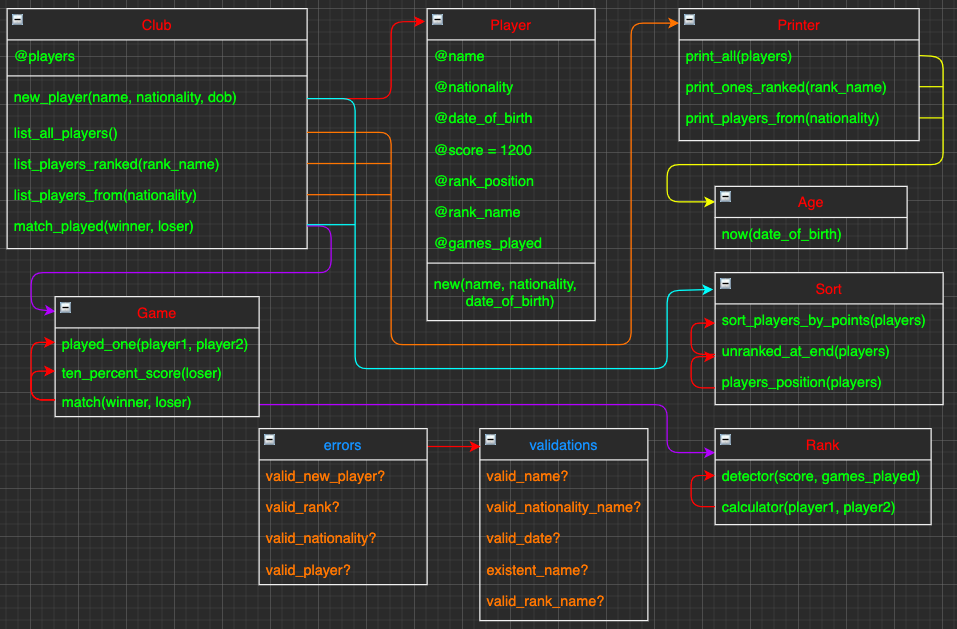

# Tennis Club
This is a simulation of a tennis club with the management of their players and rankings.
This project has been done with Ruby and tested with RSpec.
I personally added extra validations.   
## Requirements:
- **Registering a new player into the club**
  - The only required data for registration is the player’s first name and last name, nationality, and the date of birth.
  - No two players of the same first name and last name can be added.
  - Players must be at least 16 years old to be able to enter the club.
  - Each newly registered player should start with the score of 1200 points for the purpose of the ranking.
- **Listing all players in the club**
  - It should be possible to list only players of particular nationality and/or rank name (see the bottom of the document) or all players.
  - The list should contain the following information for every player:
    - the current position in the whole ranking
    - first and last name
    - age
    - nationality
    - rank name
    - points
  - The players should be ordered by points (descending).
  - The unranked players should also be ordered by points (descending) but should appear at the bottom of the list, below all other ranks.
- **Registering a match that has been played**
  - It should require providing the winner and the loser of the match.
  - The loser gives the winner 10% of his points from before the match (rounded down).
    - For example, if Luca (1000 points) wins a match against Brendan (900 points), Luca should end up with 1090 points after the game and Brendan with 810.
    - If Daniel (700 points) wins a match against James (1200 points), Daniel should end up with 820 points after the game and James with 1080.

#### Ranking:
| Rank               | Points                                    |
|--------------------|-------------------------------------------|
| Unranked           | (The player has played less than 3 games) |
| Bronze             | 0 – 2999                                  |
| Silver             | 3000 – 4999                               |
| Gold               | 5000 – 9999                               |
| Supersonic Legend  | 10000 – no limit                          |

#### Diagram of classes and methods:

